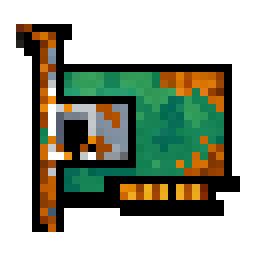

<div align="center">
  
  
  # RustyIP client
  
  [](https://hub.docker.com/r/richardsondev/rustyip)
  [](LICENSE)
  
  *A dynamic DNS client with multi-architecture support*
</div>

## Container Support
* ARM32
* ARM64
* X64

## Source
https://github.com/richardsondev/rustyip

## Prebuilt image
https://hub.docker.com/r/richardsondev/rustyip

## Usage
```bash
docker run -d --name=watchtower -v /var/run/docker.sock:/var/run/docker.sock containrrr/watchtower
docker run -d --name=RustyIP --restart always --label=com.centurylinklabs.watchtower.enable=true -e HOST='' -e KEY='' -e TOKEN='' -e HASH='' -e SLEEP_DURATION='10' richardsondev/rustyip:latest
```
